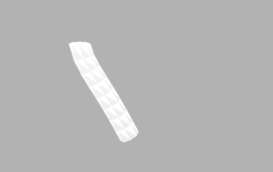

# FEM elastic rod 

- [x] Explicit taichi implementation modified from taichi example `fem99.py`.
- [x] Low-performance Implicit FEM rod C++ implementation in reference of http://www.femdefo.org/ with Eigen.
- [x] Neo-hookean material model

## INSTALL

```
msbulid FEM_rod.sln /p:configuration=Release && x64\Release\FEM_rod.exe
```

```
python fem.py
```

## Demo
1. explicit


2. implicit
   
